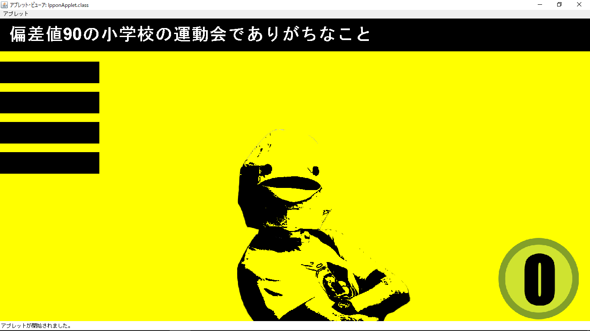
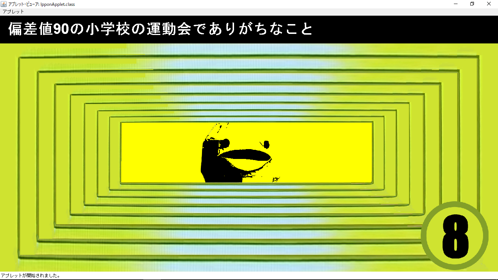
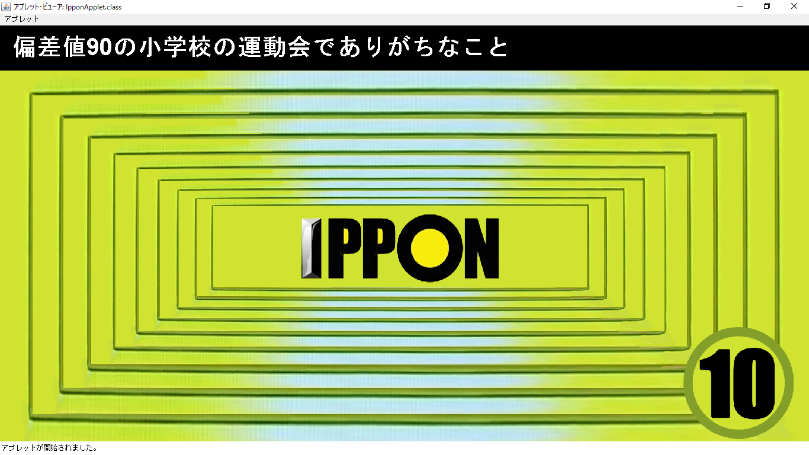

# 実行例
 
 

# 動作環境
Java version 1.8.0  

# 実行
- playerNum配列にプレイヤー名を設定
- playerフォルダに"プレイヤー名.png"を配置
- odai配列にお題を設定
- javac -encoding UTF-8 IpponApplet.java  
- appletviewer ippon.html

# 基本操作  

## プレイヤー関連
1：1番目のプレイヤー表示  
2：2番目のプレイヤー表示  
3：3番目のプレイヤー表示  
4：4番目のプレイヤー表示  
5：5番目のプレイヤー表示  
->：次のプレイヤーへ  
<-：前のプレイヤーへ  

## 採点関連
↑またはp：1ポイント加点  
↓：1ポイント減点  
Spaceまたはq：初期化  

## プレイヤー総得点関連
u：プレイヤーの総得点を加点  
d：プレイヤーの総得点を減点  

## お題関連
n：次のお題へ  
b：前のお題へ  
